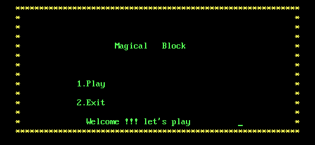
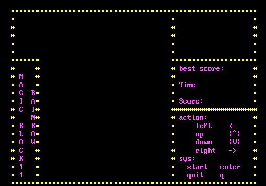
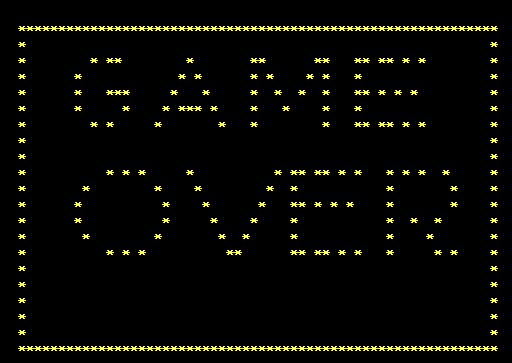

# 俄罗斯方块

2251597 韦瑾钰

## 一、项目功能介绍

本项目是基于汇编语言开发的控制台小游戏俄罗斯方块。程序运行在DOS文本模式环境下，通过直接操作VGA显存和调用BIOS / DOS中断，实现完整的游戏功能。

项目主要功能如下：

1. **游戏界面显示**

   * 启动界面与主菜单（开始游戏 / 退出）
    
   * 游戏主界面，包括游戏区域、下一方块预览、得分与时间显示
    
   * 游戏结束（Game Over）界面
    

2. **方块系统**

   * 支持多种经典方块形状（正方形、直线形、L 形、T 形、Z 形）
   * 方块随机生成，随机颜色显示
   * 支持方块旋转与不同状态切换

3. **键盘控制**

   * 方向键控制方块左右移动与加速下落
   * 上方向键控制方块旋转
   * 按键 `Q` 退出游戏

4. **游戏逻辑**

   * 方块自动下落
   * 碰撞检测（边界与已落地方块）
   * 满行检测与消行处理
   * 得分统计

5. **扩展功能**

   * 右侧显示当前系统时间（通过 CMOS 读取）
   * 使用文件读写保存最高分记录

---

## 二、项目开发流程

本项目按照自顶向下、逐步完善的方式进行开发，主要流程如下：

### 1. 环境搭建与准备

* 配置 DOSBox 汇编开发环境
* 熟悉 MASM / TASM 的基本使用
* 测试 VGA 文本模式下的字符显示与键盘中断

### 2. 界面设计

* 使用字符画设计游戏边框、菜单与提示区域
* 通过直接写入 `0B800h` 显存实现界面绘制
* 设置不同字符颜色以增强界面可读性

### 3. 方块数据设计

* 使用数据段定义不同方块的相对坐标
* 每种方块通过数据表描述结构，便于统一绘制与旋转
* 使用随机数生成当前与下一方块

### 4. 核心游戏逻辑实现

* 实现方块的下落与移动控制
* 编写碰撞检测函数，判断是否可以继续移动
* 实现方块落地后的固定与新方块生成

### 5. 消行与计分模块

* 逐行检测是否存在填满的行
* 满行时清除并下移上方内容
* 同步更新得分显示

### 6. 扩展与优化

* 增加系统时间显示模块
* 使用 DOS 文件中断实现最高分保存
* 调整下落速度与游戏体验

---

## 三、项目开发心得

通过本次俄罗斯方块汇编语言项目的开发，我对汇编语言程序设计和底层系统结构有了更加深入的理解。

首先，在界面显示方面，通过直接操作显存，使我理解了字符在屏幕上的真实存储方式，加深了对内存地址和显示机制的认识。
其次，在游戏逻辑的实现过程中，体会到了汇编语言在复杂控制结构下的编程难度，也锻炼了对寄存器、堆栈和过程调用的熟练掌握能力。
此外，项目中涉及 BIOS 中断、DOS 中断以及 CMOS 访问，使我对操作系统底层服务的使用方式有了更直观的理解。

总体而言，该项目不仅提升了我使用汇编语言解决实际问题的能力，也加深了对计算机系统底层运行原理的认识，对后续学习操作系统和系统级编程具有积极意义。

---

## 四、总结

本项目成功实现了一个功能完整、运行稳定的俄罗斯方块游戏，涵盖了汇编语言课程中的多个核心知识点。通过该项目的设计与实现，不仅巩固了课堂所学内容，也提高了独立分析问题和解决问题的能力。

