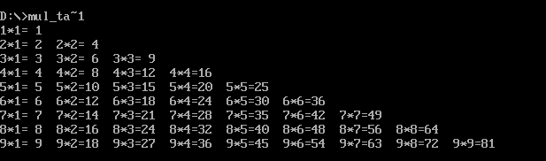

九九乘法表打印结果

c语言实现：
```
#include <stdio.h>

int main() {
    int i, j;
    
    for (i = 9; i >= 1; i--) {
        for (j = 1; j <= i; j++) {
            printf("%d*%d=%-2d ", i, j, j * i);
        }
        printf("\n");
    }
    
    return 0;
}
```
反编译：
```
0761:0000 BB7107     MOV     BX, 0771    ; BX指向输出缓冲区或数据区
0761:0003 BEDB       MOV     SI, BX      ; SI也指向同一位置
0761:0005 B90900     MOV     CX, 0009    ; 外层循环计数器CX=9（行数）
0761:0008 B60A       MOV     DH, 0A      ; DH=10（可能用于数字格式化）
0761:000A FEC9       DEC     CL          ; 内层循环计数器CL减1（列数调整）
0761:000C B201       MOV     DL, 01      ; DL=1（内层循环起始值）
0761:000E BAC6       MOV     AL, DH      ; AL=10
0761:0010 25FF00     AND     AX, 00FF    ; 清零AH，AX=000A
0761:0013 3AD6       CMP     DL, DH      ; 比较当前列(DL)和行(DH)
0761:0015 7712       JA      0029        ; 如果列>行，跳转到循环结束
0761:0017 52         PUSH    DX          ; 保存DX（行列值）
0761:0018 51         PUSH    CX          ; 保存CX（循环计数器）
0761:0019 50         PUSH    AX          ; 保存AX
0761:001A 52         PUSH    DX          ; 再次保存DX（为乘法准备）
0761:001B BAC6       MOV     AL, DH      ; AL=行号
0761:001D F6E2       MUL     DL          ; AX=AL×DL（行×列）
0761:001F 50         PUSH    AX          ; 保存乘法结果
```
九九乘法表纠错