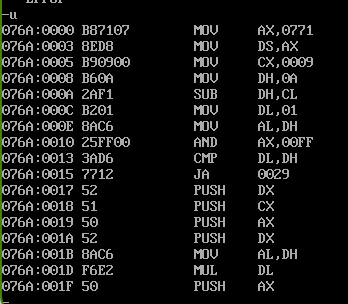
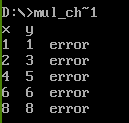
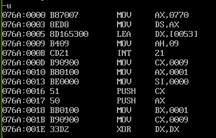

九九乘法表打印结果

c语言实现：
```
#include <stdio.h>

int main() {
    int i, j;
    
    for (i = 9; i >= 1; i--) {
        for (j = 1; j <= i; j++) {
            printf("%d*%d=%-2d ", i, j, j * i);
        }
        printf("\n");
    }
    
    return 0;
}
```
反汇编：

```
076A:0000 B87107     MOV     AX, 0771    ; 设置数据段地址为0771H
076A:0003 8ED8       MOV     DS, AX      ; 将AX值赋给数据段寄存器DS
076A:0005 B90900     MOV     CX, 0009    ; 设置CX=9（外层循环计数器，控制行数）
076A:0008 B60A       MOV     DH, 0A      ; 设置DH=10（用于计算行号）
076A:000A 2AF1       SUB     DH, CL      ; DH = 10 - CL，计算当前行号（从9到1递减）
076A:000C B201       MOV     DL, 01      ; 设置DL=1（内层循环计数器，控制列数，从1开始）
076A:000E 8AC6       MOV     AL, DH      ; 将行号DH复制到AL
076A:0010 25FF00     AND     AX, 00FF    ; 清除AH，只保留AL（行号）
076A:0013 3AD6       CMP     DL, DH      ; 比较DL（列号）和DH（行号）
076A:0015 7712       JA      0029        ; 如果列号>行号，跳转到0029（跳过后续计算）
076A:0017 52         PUSH    DX          ; 保存DX（行列值）
076A:0018 51         PUSH    CX          ; 保存CX（外层循环计数）
076A:0019 50         PUSH    AX          ; 保存AX（行号）
076A:001A 52         PUSH    DX          ; 再次保存DX
076A:001B 8AC6       MOV     AL, DH      ; AL = 行号
076A:001D F6E2       MUL     DL          ; AX = AL * DL（行号×列号，计算乘积）
076A:001F 50         PUSH    AX          ; 保存乘积结果
```
九九乘法表纠错

c语言实现：
```
#include <stdio.h>

int multiplication_table[9][9] = {
    {7, 2, 3, 4, 5, 6, 7, 8, 9},      // 第1行
    {2, 4, 7, 8, 10, 12, 14, 16, 18}, // 第2行  
    {3, 6, 9, 12, 15, 18, 21, 24, 27},// 第3行
    {4, 8, 12, 16, 7, 24, 28, 32, 36},// 第4行
    {5, 10, 15, 20, 25, 30, 35, 40, 45},// 第5行
    {6, 12, 18, 24, 30, 7, 42, 48, 54},// 第6行
    {7, 14, 21, 28, 35, 42, 49, 56, 63},// 第7行
    {8, 16, 24, 32, 40, 48, 56, 7, 72}, // 第8行
    {9, 18, 27, 36, 45, 54, 63, 72, 81} // 第9行
};

// 检查乘法表正确性的函数
void check_multiplication_table() {
    int error_count = 0;
    
    printf("x y\n"); // 输出表头
    
    // 双循环遍历整个乘法表
    for (int i = 0; i < 9; i++) {        // 外层循环：行
        for (int j = 0; j < 9; j++) {    // 内层循环：列
            int expected = (i + 1) * (j + 1); // 正确的结果应该是 (行号)×(列号)
            int actual = multiplication_table[i][j]; // 实际存储的值
            
            // 检查是否正确
            if (expected != actual) {
                error_count++;
                printf("%d %d error\n", i + 1, j + 1); // 输出错误位置（从1开始计数）
            }
        }
    }
    
    printf("\nTotal errors: %d\n", error_count);
}

int main() {;
    
    check_multiplication_table();
    
    return 0;
}
```
反汇编：

076A:0000 B87007    MOV AX,0770    ; 设置数据段地址为0770H
076A:0003 8ED8      MOV DS,AX      ; 将AX值赋给数据段寄存器DS
076A:0005 BD165300  LEA DX,[0053]  ; 将偏移地址0053加载到DX（字符串地址，可能是乘法表标题）
076A:0009 B409      MOV AH,09      ; 设置AH=09H（DOS功能调用：显示字符串）
076A:000B CD21      INT 21         ; 调用DOS中断21H（显示DX指向的字符串）
076A:000D B90900    MOV CX,0009    ; 设置CX=9（外层循环计数器，控制行数1-9）
076A:0010 B80100    MOV AX,0001    ; 设置AX=1（行号初始值）
076A:0013 BE0000    MOV SI,0000    ; 设置SI=0（数组索引或数据指针）
076A:0016 51        PUSH CX        ; 保存CX到堆栈（保存外层循环计数）
076A:0017 50        PUSH AX        ; 保存AX到堆栈（保存当前行号）
076A:0018 BB0100    MOV BX,0001    ; 设置BX=1（列号初始值）
076A:001B B90900    MOV CX,0009    ; 设置CX=9（内层循环计数器，控制列数1-9）
076A:001E 33D2      XOR DX,DX      ; 清空DX寄存器（为乘法运算准备，存放乘积结果）